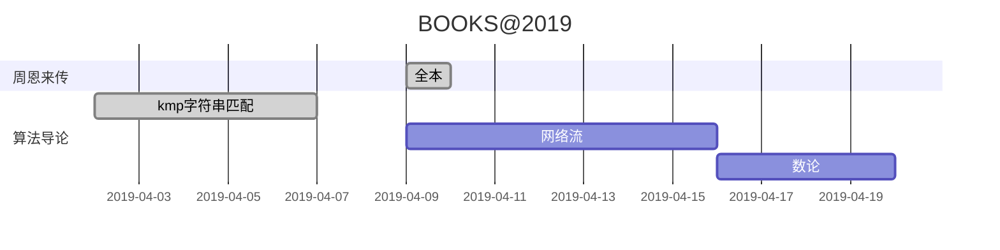

#这里简述markdown使用的小技巧与使用规范
- 大部分的编译器都支持markdown
- 在使用markdown的时候要注意后缀名为.md

- #加空格加上子集想要的标题,有几个#表示的就是几级标题
    - # 一级标题
    - ## 二级标题
    - ### 三级标题
    - #### 四级标题
    - ##### 五级标题
    - ###### 六级标题
    - 经过测试可以知道,#可以叠加的最大数量为6个 
- 对于字体
    - 斜体:在想要输出的文字的两端各使用一个星号
        - *你好*
    - 粗体:在想要输出的文字的各两边加上两个星号
        - **你好**
    - 斜体加粗:在想要输出的文字的各两端加上三个星号
        - ***你好***
- 列表
    - 有序列表
1. 有序项1
2. 有序项2
3. 有序项3
    - 无序列表
* 无序项a
* 无序项b
* 无序项c
    - 有序列表嵌套无序列表
1. 有序项1
    * 无序项a
    * 无序项b
2. 有序项2
    
    - 无序列表嵌套有序列表
* 无序项a
    1. 有序项1
    2. 有序项2
* 无序项b

- 编程中最常用的写法——高亮代码块，以cpp为例。用```cpp开头，以```结尾将代码块包裹起来。
- 使用>来表示一段引用
>这是一段引用

- 快速添加链接的方式[]{}
[百度的网站]{www.baidu.com}
- 使用语法进行添加图片
![百度的logo]{www.baidu.com}


- 关于使用mermaid(美人鱼)插件绘画出markdown的表格
学习网址:https://www.cnblogs.com/wuyida/p/6301240.html
等待补充

- 使用划线的情况：
    - ~~你好啊~~

- mermaid画图的方法
    - mermaid是一个可以在markdown里面使用的一个工具，可以用来画图
    - 举一个例子



